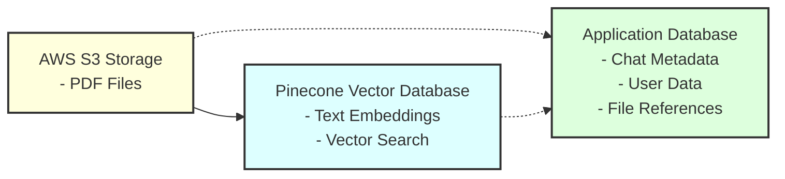
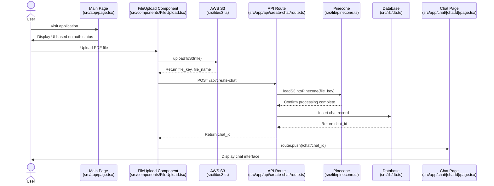

# ChatPDF Application Diagrams

This document provides instructions for creating visual diagrams of the ChatPDF application flow. You can use these instructions to create professional diagrams using tools like [draw.io](https://app.diagrams.net/), [Lucidchart](https://www.lucidchart.com/), or [Mermaid Live Editor](https://mermaid.live/).

## Application Flow Diagram

Create a flowchart with the following components and connections:

### Components to Include:

1. **Authentication Layer (Clerk)**

   - Box at the top of the diagram

2. **Main Page (src/app/page.tsx)**

   - Box with two branches:
     - Not Authenticated → Login Button → Sign-in Page
     - Authenticated → FileUpload Component

3. **File Upload Flow**
   - File Selection & Upload
   - S3 Upload
   - API Call to create-chat
4. **API Route (src/app/api/create-chat/route.ts)**

   - Auth Verification
   - loadS3IntoPinecone
   - Database Insert
   - Return chat_id to client

5. **Redirection**

   - Router.push to /chat/[chat_id]

6. **Chat Page (src/app/chat/[chatId]/page.tsx)**
   - Auth Verification
   - Load Chat Data
   - Chat UI

### Mermaid Diagram Code

You can use this Mermaid code to generate the diagram:

```mermaid
flowchart TD
    A[Authentication Layer\nClerk] --> B[Main Page\nsrc/app/page.tsx]

    B -->|Not Authenticated| C[Login Button]
    B -->|Authenticated| D[FileUpload Component\nsrc/components/FileUpload.tsx]

    C --> E[Sign-in Page]
    D --> F[File Selection & Upload]

    F --> G[S3 Upload\nsrc/lib/s3.ts]
    G --> H[API Call to create-chat\naxios.post]

    H --> I[API Route\nsrc/app/api/create-chat/route.ts]

    I --> J[Auth Verification]
    J --> K[loadS3IntoPinecone]
    K --> L[Database Insert]

    L --> M[Return chat_id to client]
    M --> N[Router.push to /chat/chat_id]

    N --> O[Chat Page\nsrc/app/chat/[chatId]/page.tsx]
    O --> P[Auth Verification]
    P --> Q[Load Chat Data]
    Q --> R[Chat UI]

    style A fill:#f9f,stroke:#333,stroke-width:2px
    style B fill:#bbf,stroke:#333,stroke-width:2px
    style I fill:#bfb,stroke:#333,stroke-width:2px
    style O fill:#fbb,stroke:#333,stroke-width:2px
```

## Data Storage Components Diagram

Create a diagram showing the three main storage components and their relationships:

### Components to Include:

1. **AWS S3 Storage**
   - Stores PDF Files
2. **Pinecone Vector Database**
   - Stores Text Embeddings
   - Provides Vector Search capabilities
3. **Application Database**
   - Stores Chat Metadata
   - Stores User Data
   - Stores File References

### Mermaid Diagram Code



## Detailed Data Flow Diagram

Create a sequence diagram showing the step-by-step flow of data through the application:

### Mermaid Diagram Code



## How to Use These Diagrams

1. Copy the Mermaid code blocks above
2. Paste them into [Mermaid Live Editor](https://mermaid.live/)
3. Generate the diagrams
4. Download as SVG or PNG
5. Add them to your project documentation

Alternatively, you can recreate these diagrams in your preferred diagramming tool using the component descriptions provided.

## Recommended Diagram Tools

- **[draw.io](https://app.diagrams.net/)** - Free, powerful diagramming tool
- **[Lucidchart](https://www.lucidchart.com/)** - Professional diagramming tool (free tier available)
- **[Mermaid Live Editor](https://mermaid.live/)** - Code-based diagram generation
- **[Excalidraw](https://excalidraw.com/)** - Hand-drawn style diagrams
- **[Figma](https://www.figma.com/)** - Design tool with diagramming capabilities

Save the generated diagrams in the `docs/images/` folder for reference.
