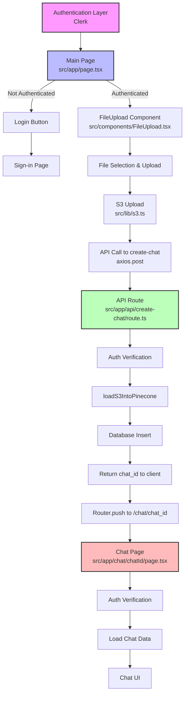
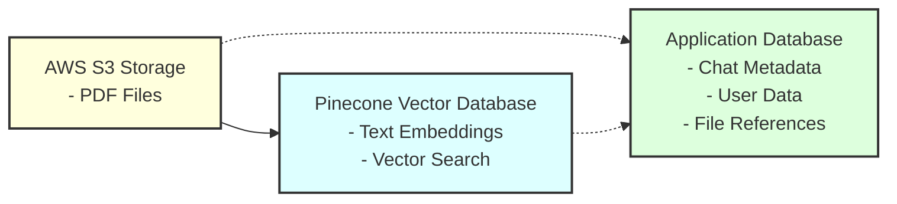
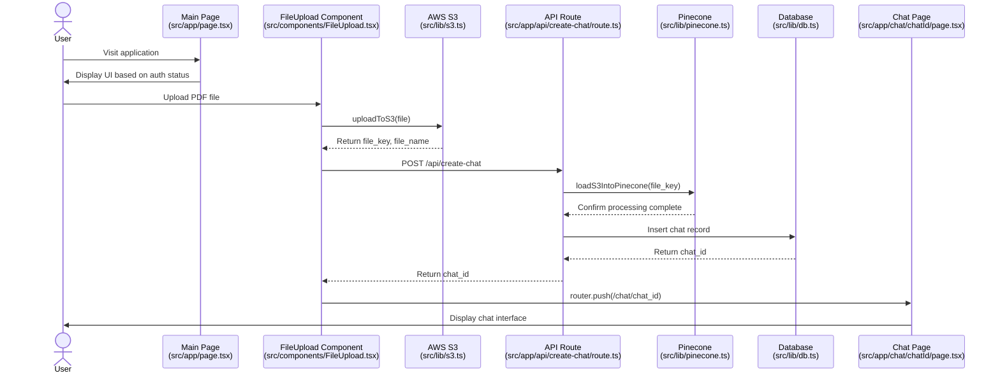
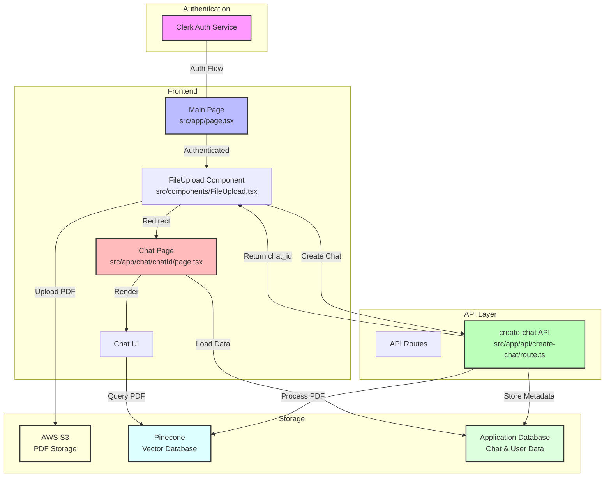

# Complete Diagram Code

This file contains the complete Mermaid code for all diagrams. You can copy each code block and paste it directly into [Mermaid Live Editor](https://mermaid.live/) to generate the diagrams.

## 1. Application Flow Diagram (Complete Code)

## 2. Data Storage Components Diagram (Complete Code)

## 3. Detailed Data Flow Diagram (Complete Code)

## 4. Combined Application Architecture (Complete Code)

## How to Use

1. Copy the entire code block for the diagram you want to create
2. Go to [Mermaid Live Editor](https://mermaid.live/)
3. Paste the code into the editor
4. The diagram will be generated automatically
5. Download as SVG or PNG using the "Export" button
6. Save the image to the `docs/images/` folder
